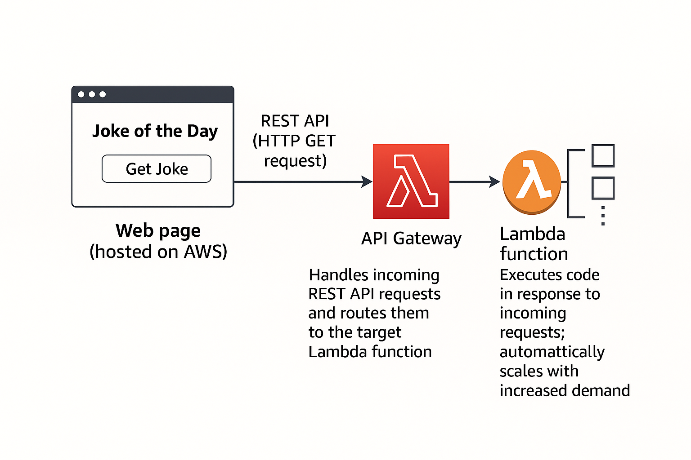

# Joke of the Day App - CMiC MBO 2025 Demo Project



## Demo

Live demo: [http://getjokeappbucket.s3-website-us-east-1.amazonaws.com/](http://getjokeappbucket.s3-website-us-east-1.amazonaws.com/)

## Architecture Overview

The diagram above illustrates the serverless architecture for the Joke of the Day app:

- **Web page (hosted on AWS S3):** The static frontend is served from an S3 bucket. When a user clicks the "Get Joke" button, the page sends a REST API (HTTP GET) request.
- **API Gateway:** This component receives the HTTP request from the web page. It acts as a managed entry point, routing the request to the appropriate backend service.
- **Lambda function:** The API Gateway triggers an AWS Lambda function. The Lambda function executes code in response to the request, fetches a joke from an external API, and returns the result. Lambda automatically scales to handle increased demand.

This serverless setup ensures scalability, low maintenance, and cost efficiency, as resources are only used when requests are made.

This project fetches a random joke from JokeAPI using AWS Lambda, API Gateway, and serves a frontend from S3.

## 🛠️ Stack

- AWS Lambda (Node.js)
- API Gateway (REST API)
- S3 (Static Website Hosting)

## 📁 Structure

- `s3/index.html`: The frontend
- `lambda/index.js`: The serverless function
- `infra/`: (optional) Infrastructure scripts (Terraform/CDK/notes)

## API Gateway Configuration

- **Endpoint:** `https://<api-id>.execute-api.<region>.amazonaws.com/prod/joke`
- **Method:** GET
- **Integration:** Lambda Proxy
- **CORS:** Enabled (`Access-Control-Allow-Origin: *`)
- **Security:** Public (no authentication for demo)
- **Mapping:** Forwards all requests to the Lambda function, which fetches a joke and returns a simplified response.

## API Gateway Security Policy

The API Gateway is secured with a resource-based policy that:

1. Only allows requests from the S3 bucket website
2. Uses the `aws:Referer` condition to verify the request origin
3. Restricts access to only the `/joke` endpoint

### Security Measures

- The policy ensures that only requests coming from our S3 bucket website can access the API
- The `aws:Referer` condition prevents unauthorized access from other sources
- The policy is scoped to only the specific API endpoint needed

### Implementation Notes

When implementing this policy:

1. Replace `REGION` with your AWS region
2. Replace `ACCOUNT_ID` with your AWS account ID
3. Replace `API_ID` with your API Gateway ID
4. Replace `BUCKET_NAME` with your S3 bucket name

### Best Practices

- Keep the actual policy file with real values secure and out of version control
- Use template files for documentation purposes
- Regularly review and update the policy as needed
- Consider implementing additional security measures like API keys or IAM roles if needed

## 🔧 How It Works

1. `index.html` is hosted in an S3 bucket (static website enabled, public access allowed).
2. Clicking the button sends a `GET` request to the API Gateway.
3. API Gateway triggers a Lambda function.
4. Lambda fetches a joke from `https://sv443.net/jokeapi/v2/joke/Any` and returns a simplified response.
5. The frontend displays the joke.

## 🧪 Example Response

```json
{
  "setup": "Why do cows have hooves instead of feet?",
  "delivery": "Because they lactose."
}
```
